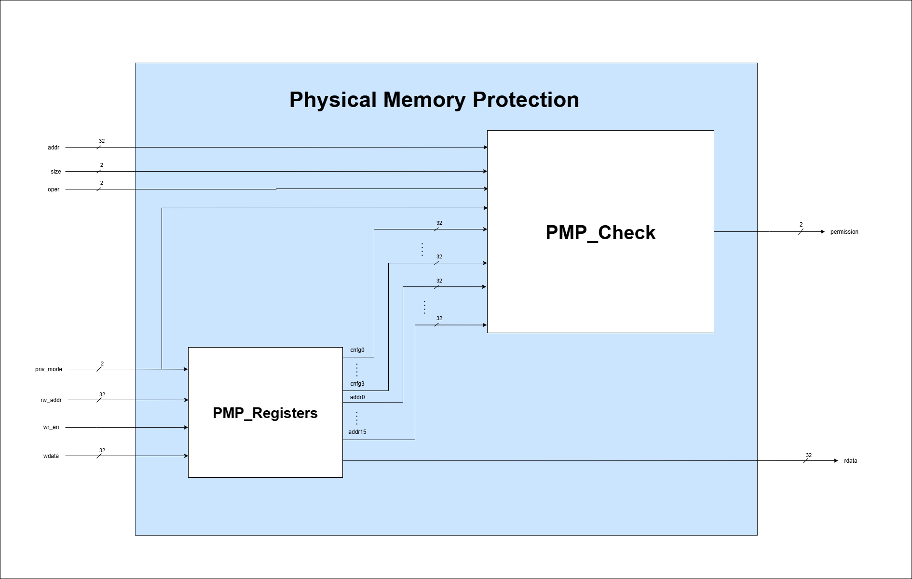

# PMP

A SystemVerilog implementation of Physical Memory Protection (PMP) for RISC-V. This repository contains RTL modules, definitions, and a self-driving testbench for simulation and verification.


### PMP Module Overview


The `pmp` module is a standalone SystemVerilog implementation of Physical Memory Protection for RISC-V. This implementation features:
- 16 PMP entries (configurable regions)
- 4-byte grain size (minimum region size)
- Configuration and storage of PMP address and configuration registers
- Address matching for TOR, NA4, and NAPOT regions
- Permission checks for read, write, and execute accesses
- Enforcement of privilege modes and lock bits



#### Main Inputs
- `clock`, `reset`: Standard clock and reset signals
- `wr_en`, `rw_addr`, `wdata`: Write enable, register address, and data for configuration/address updates
- `priv_mode`, `size`, `oper`, `addr`: Privilege mode, access size, operation type (read/write/execute), and memory address to check

#### Main Outputs
- `permission`: Indicates if the requested access is allowed (based on PMP configuration)
- `rdata`: Data read from PMP configuration/address registers

See `rtl/pmp.sv` for full port list and configuration details.

## Directory Structure

```
pmp-sv32/
├── defines/                # Common definitions and types (SystemVerilog packages)
│   └── cep_define.sv
├── rtl/                    # RTL source files for PMP logic
│   ├── tor.sv
│   ├── addr_check_n.sv
│   ├── na4.sv
│   ├── napot.sv
│   ├── pmp.sv
│   ├── pmp_check.sv
│   └── pmp_registers.sv
└── testbench/
    ├── Self_driving_testbench/
    │   ├── pmp_tb.sv      # Top-level testbench that tests the entire pmp module
    │   ├── c.bat          # Windows batch script for simulation
    │   └── clean.bat      # Windows batch script for cleaning the simulation files
    └── Simple_testbenches/
        ├── tor_tb.sv            # Testbench for tor.sv
        ├── na4_tb.sv            # Testbench for na4.sv
        ├── napot_tb.sv          # Testbench for napot.sv
        ├── addr_check_n_tb.sv   # Testbench for addr_check_n.sv
        ├── pmp_registers_tb.sv  # Testbench for pmp_registers.sv
        └── pmp_tb.sv            # Testbench for pmp.sv
```

## Getting Started

### Prerequisites

- [QuestaSim](https://www.mentor.com/products/fv/questa/) or compatible simulator
- Windows OS (for `c.bat` batch script)
- SystemVerilog support

### How to Simulate

1. **Clone the repository** to your local machine.
2. **Set the base directory** in `testbench/Self_driving_testbench/c.bat`:
    - Open `c.bat` in a text editor.
    - Update the `BASE_DIR` variable to the absolute path where you cloned the repo.
    - Example:
      ```
      set BASE_DIR=C:\Users\<your-username>\Documents\pmp-sv32
      ```
3. **Open a terminal** in `testbench/Self_driving_testbench`.
4. **Run the batch script**:
    ```
    c.bat
    ```
    This will clean previous simulation files, compile all sources, and run the testbench.

### File Overview

- **defines/cep_define.sv**: Contains enums, types, and constants for PMP configuration and CSRs.
- **rtl/pmp.sv**: Top-level PMP module implementing all PMP logic.
- **rtl/**: Contains all RTL modules implementing PMP logic and address matching.
- **testbench/Self_driving_testbench/pmp_tb.sv**: Self-driving testbench for automated verification.
- **testbench/Self_driving_testbench/c.bat**: Batch script to compile and simulate the design.

## License

This project is licensed under the Apache License, Version 2.0. See the [LICENSE](LICENSE) file for details.

## Authors

- Muhammad Boota
- Muhammad Furrukh
- Umair Ahmad
- Salman Aslam
- Waleed Tariq

## Support

For issues or questions, please open an issue on the [GitHub repository](https://github.com/your-repo-url)